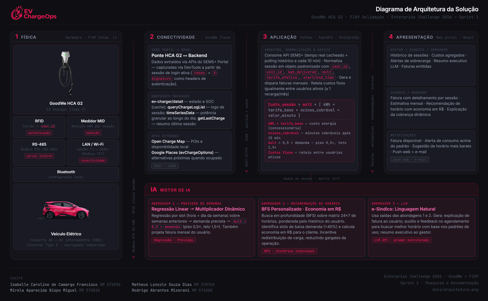

# EV ChargeOps - Enterprise Challenge 2026

### GoodWe + FIAP · Sprint 1 · Pesquisa e Documentação

---


## Equipe

| Nome | RM |
|------|----|
| Isabelle Caroline de Camargo Francisco | 572096 |
| Matheus Lyncoln Souza Dias | 570765 |
| Mirela Aparecida Bispo Miguel | 570830 |
| Rodrigo Abrantes Mizerani | 571808 |

---

## O problema

O crescimento acelerado de veículos elétricos no Brasil cria uma pressão concreta em ambientes compartilhados: condomínios residenciais, edifícios corporativos e campus universitários passam a ter múltiplos veículos disputando uma infraestrutura de recarga comum, sem nenhum mecanismo integrado para organizar esse uso.

O gargalo não é instalar o carregador. É o que vem depois: quem usou, quanto consumiu, quanto deve pagar e como o gestor prova isso para todos os envolvidos.

Cada sessão de recarga produz dados - *duração, energia entregue em kWh, horário, picos, ociosidade.* Quando esses dados ficam presos no equipamento ou em portais genéricos, eles são apenas registros. Quando são capturados, estruturados e processados com inteligência, eles se tornam a base de uma operação justa, auditável e escalável.

O EV ChargeOps propõe exatamente essa transformação para o carregador GoodWe HCA G2 instalado no estacionamento L1 da FIAP - Unidade Aclimação, operado em parceria com o Energy Innovation Lab.

---

## Frente 1 - Contexto e Problema

### Infraestruturas de recarga compartilhada

Infraestruturas de recarga compartilhada são sistemas de carregamento instalados em ambientes de uso coletivo, onde múltiplos usuários dividem a mesma rede elétrica, os mesmos pontos de recarga e, normalmente, um sistema central de autenticação, monitoramento e tarifação.

O problema central nesse tipo de ambiente deixa de ser apenas a capacidade de carregar o veículo e passa a incluir:

- Distribuição justa da capacidade elétrica disponível, com risco real de sobrecarga se não houver balanceamento
- Controle de acesso e autenticação - evitar que um usuário não cadastrado utilize o ponto
- Conflitos de uso de vaga, especialmente quando o veículo fica parado depois de terminar a recarga
- Medição individualizada do consumo para que a cobrança ou o rateio sejam auditáveis
- Manutenção e indisponibilidade dos equipamentos, que comprometem a confiança na operação
- Integração entre hardware, software, gestão do condomínio/empresa e, em alguns casos, a distribuidora de energia

Em condomínios e campus universitários, esses desafios crescem porque há diferentes perfis de uso, horários de pico variados e a necessidade de distribuir custos de forma transparente entre pessoas com padrões de consumo muito distintos.

### Anatomia técnica de uma sessão de recarga

Uma sessão começa quando o veículo é conectado ao carregador. O equipamento realiza verificações de segurança - verifica aterramento, estado da conexão e limites de corrente - e só então libera energia. Em carregamento AC (como o HCA G2), o veículo faz a conversão para corrente contínua internamente pelo seu próprio carregador embarcado.

Durante a sessão, o sistema registra continuamente:

- Identificação do carregador e da porta
- Identificação do usuário (via RFID, app ou credencial)
- Timestamp de início, eventuais pausas e encerramento
- Energia total consumida em kWh
- Potência instantânea, corrente e tensão ao longo da sessão
- Alarmes, falhas, desconexão do veículo e interrupções de segurança

A sessão encerra quando a bateria atinge o nível desejado, o usuário interrompe manualmente, o cabo é desconectado ou o sistema detecta alguma condição que exija desligamento. Ao final, os dados consolidados podem alimentar faturamento, auditoria, manutenção preditiva e planejamento de capacidade.

O protocolo OCPP (Open Charge Point Protocol) é o padrão aberto de mercado para esse fluxo de dados, publicando eventos como `StartTransaction`, `MeterValues` e `StopTransaction` - ou equivalentes nas versões mais recentes - e permitindo telemetria quase em tempo real entre o carregador e a plataforma de gestão. No caso do GoodWe HCA G2, porém, o fluxo de dados é transportado por Modbus (RS‑485/TCP) e pela plataforma SEMS/SEMS+, em vez de OCPP.


### Modelos de negócio para recarga compartilhada

| Modelo | Como funciona | Vantagem | Limitação |
|--------|--------------|----------|-----------|
| Cobrança por kWh | Preço proporcional à energia efetivamente consumida | Mais justo economicamente | Exige medição confiável e conformidade regulatória |
| Cobrança por tempo | Preço pelo tempo de permanência conectado | Incentiva rotatividade da vaga | Pode ser percebido como injusto quando veículos aceitam potências diferentes |
| Assinatura mensal | Mensalidade fixa, com ou sem franquia de uso | Previsibilidade para o operador | Menos justo quando perfis de uso são muito desiguais |
| Rateio condominial | Custos distribuídos entre usuários cadastrados | Simplifica a administração no curto prazo | Gera conflitos quando não há rastreabilidade individual do consumo |

O modelo que o EV ChargeOps adota como base é a **cobrança por kWh efetivamente entregue**, mas com tarifa **dinâmica** - modulada por um multiplicador de demanda calculado por hora/dia - somada a uma penalidade por **ociosidade da vaga**, e complementada por um **rateio igualitário dos custos fixos da infraestrutura** entre os usuários ativos. O detalhamento completo do modelo, com a fórmula e o multiplicador, está na Frente 3.

### 1.1 Aprofundamento - Análise de mercado

O mercado de recarga compartilhada ainda é fragmentado entre hardware inteligente, software de gestão e estratégias de monetização. A maioria das soluções é forte em uma dessas camadas, mas apresenta lacunas quando o cenário exige simultaneamente autenticação multiusuário, rateio transparente, controle de vagas, monitoramento energético e integração administrativa.

| Solução | Problema que resolve | Força central | Limitação relevante |
|---------|---------------------|---------------|---------------------|
| **ChargePoint** | Operar e monetizar redes de recarga em escala corporativa | Plataforma aberta, monitoramento centralizado, cobrança e suporte integrados | Mais pesada e cara de implantar; menos focada em rateio condominial simples |
| **Wallbox Pulsar Plus** | Carregamento inteligente em residências e pequenos estacionamentos compartilhados | App móvel, agendamento, monitoramento e power sharing local | Não entrega gestão multiusuário robusta para operações condominiais complexas |
| **Zaptec** | Gestão de múltiplos pontos com balanceamento de carga em ambientes compartilhados | OCPP, medição MID, smart charging e gestão profissional da infraestrutura | Forte na operação do carregador; menos completa em billing e analytics de negócio |
| **NeoCharge** | Compartilhamento inteligente de um circuito entre dois usos | Priorização automática e uso compartilhado da capacidade elétrica existente | Proposta adequada para uso doméstico; não serve para gestão estruturada de múltiplos usuários |
| **Copel Telecom EV** | Gerenciamento técnico com integração à rede elétrica e geração fotovoltaica | Controle em tempo real, resposta à demanda e coordenação com geração distribuída | Mais próximo de projeto de P&D do que de produto SaaS escalável |

**O que essa análise evidencia para o EV ChargeOps:** há espaço real para uma plataforma que integre medição, autorização, histórico de sessões, cobrança e inteligência operacional em uma única camada de software - especialmente voltada para condomínios, edifícios e campus que precisam de operação compartilhada com rastreabilidade individual.

---

## Frente 2 - Base Regulatória e Técnica

### ANEEL REN 1.000/2021

A resolução que regula a recarga de veículos elétricos no Brasil hoje é a Resolução Normativa nº 1.000/2021 da ANEEL, que absorveu o conteúdo da REN 819/2018 no seu Capítulo V. Os pontos mais relevantes para o EV ChargeOps:

**Exploração comercial livre:** qualquer pessoa ou empresa pode oferecer recarga como serviço para terceiros e definir o preço livremente, sem autorização prévia da ANEEL. Isso vale tanto para operadores privados quanto para distribuidoras de energia, desde que essas últimas mantenham contabilidade separada da operação de fornecimento.

**Comunicação prévia à distribuidora:** obrigatória somente quando a instalação do carregador aumentar a potência disponibilizada, a carga existente no local ou exigir mudança no nível de tensão da conexão. Na prática, isso é feito via formulário no momento do pedido de ligação. Para o EV ChargeOps, dependendo da potência total instalada com o HCA G2, essa comunicação pode se tornar necessária.

**Protocolos abertos obrigatórios:** equipamentos que não são de uso exclusivamente privado - ou seja, que vão atender mais de um usuário - precisam ser compatíveis com protocolos abertos de domínio público, tanto para medição quanto para controle remoto. Esse é um dos motivos pelos quais o OCPP se tornou padrão de mercado: ele impede a dependência de um único fabricante e garante interoperabilidade entre carregadores e plataformas de gestão.

> O carregador HCA G2 da FIAP opera em contexto compartilhado (campus universitário, múltiplos usuários), portanto a conformidade com protocolos abertos é uma exigência regulatória direta para esse projeto.

### Carregador GoodWe HCA G2 - interfaces disponíveis

O HCA G2 oferece múltiplas interfaces que podem ser usadas pela plataforma EV ChargeOps:

| Interface | O que permite |
|-----------|--------------|
| **2x RS-485** | Barramento serial Modbus RTU (9600, 8N1) para integração com HEMS/inversor GoodWe, medidor MID e controle local do carregador.  |
| **LAN (Ethernet)** | Conecta o carregador à rede IP e ao SEMS/SEMS+ usando Modbus TCP como transporte até o ecossistema GoodWe. Principalmente caminho até a nuvem GoodWe (SEMS), onde existem APIs HTTPS oficiais (OpenAPI, Real‑time Data Monitoring, Batch Remote Control). |
| **Wi-Fi** | Alternativa sem fio à LAN para conectar o HCA G2 ao roteador/SEMS, comissionar o equipamento e mantê‑lo online. |
| **Bluetooth** | Comunicação local de curto alcance entre a wallbox e o app SolarGo/SEMS Portal para instalação, parametrização e operação offline. |
| **RFID** | Método de autenticação local; a HCA G2 acompanha cartões RFID para iniciar/parar sessões e associar consumo a usuários. |

Para o EV ChargeOps, o **RFID é a interface mais estratégica** para identificação da sessão - cada cartão mapeia para uma unidade/morador, tornando a atribuição de consumo confiável e independente de o usuário abrir um aplicativo. O Wi-Fi/LAN viabiliza a telemetria contínua via API SEMS. No EV ChargeOps os IDs de cartões RFID serão mapeados nas contas dos usuários.

### API GoodWe SEMS Portal - endpoints mapeados

O grupo mapeou diretamente os endpoints disponíveis para o carregador instalado na FIAP (SN: 57000HPA247L0002) a partir do DevTools do SEMS Portal. Todos os endpoints exigem autenticação por headers `token` (JSON com uid/token/timestamp) e `X-Signature`, capturados da sessão de login ativa. Uma captura de exemplo das respostas está em [`assets/api-semsportal.json`](assets/api-semsportal.json) (`control-item-content-list`, `ev-charger/detail`, `getLastCharge` e `queryChargeLogList`; o endpoint `timeSeriesData` não está nesta amostra).

| Endpoint | Método | Função | Dados retornados |
|----------|--------|--------|-----------------|
| `/api/ev-charger/control-item-content-list/{sn}` | GET | Capacidades do dispositivo | Modelo, potência nominal, funções suportadas |
| `/api/ev-charger/detail` | POST `{sn, productModel}` | Status em tempo real | SOC, potência máxima de carga, agendamento, modo de carga, estado do plugue |
| `/api/v1/chargePile/getLastCharge` | GET `?chargeSn=&pwId=` | Última sessão de carga | kWh, duração, autonomia, potência |
| `/api/v1/chargePile/queryChargeLogList` | POST `{sn, startTime, endTime, pageNum, pageSize}` | Histórico paginado de sessões | Lista completa com início/fim, energia verde vs. rede, causa de encerramento |
| `/portal/equipments/{sn}/timeSeriesData` | POST `{sn, deviceType, stationId, group, module, startDateTime, endDateTime, timeGranularity}` | Série temporal granular | Potência a cada 10 minutos ao longo do dia |

**Campos relevantes do `queryChargeLogList`:**
- `chargeStartTime` / `chargeEndTime` - delimitação da sessão
- `currentChargeQuantity` - kWh totais entregues
- `greenElec` vs `purElec` - energia solar vs. energia da rede (útil para análise de autoconsumo)
- `mileage`, `chargeTimeLength`, `chargeEndCause` - contexto adicional da sessão

**Campo mais rico para estado atual:** `ev-charger/detail`, que expõe `soc`, `chargeMode`, `scheduleTime`, `dynamicLoad` e `workState`.


### 2.1 Aprofundamento - Mapeamento de APIs complementares

Além da API SEMS, duas APIs externas foram avaliadas para enriquecer a plataforma:

**Open Charge Map API**

A Open Charge Map mantém o maior banco colaborativo de pontos de recarga do mundo, com cobertura no Brasil. A API REST expõe dados de estações cadastradas com geolocalização, tipo de conector, operador, status de disponibilidade e avaliações de usuários.

- Endpoint base: `https://api.openchargemap.io/v3/poi/`
- Formato: JSON
- Uso potencial no EV ChargeOps: mapear pontos próximos ao usuário, exibir contexto de rede de recarga regional no dashboard do gestor e cruzar dados de uso do HCA G2 com o perfil da infraestrutura disponível na cidade

**Google Places API - campo `evChargeOptions`**

A Google Places API, na sua versão mais recente, inclui o campo `evChargeOptions` nos dados de estabelecimentos, expondo informações sobre conectores disponíveis, potência e disponibilidade em tempo real onde suportado.

- Documentação: `developers.google.com/maps/documentation/places`
- Formato: JSON
- Uso potencial no EV ChargeOps: enriquecer a interface do usuário com contexto de localização, permitir que moradores ou gestores vejam a situação de pontos alternativos quando o HCA G2 estiver ocupado

---

## Frente 3 - Arquitetura e IA


### As quatro camadas da plataforma

A arquitetura do EV ChargeOps é organizada em quatro camadas - física, conectividade, aplicação e apresentação -, com a IA atravessando as duas últimas. Cada camada abaixo reflete as decisões de arquitetura já fechadas nesta Sprint 1.



**Detalhamento dos componentes de cada camada:**

- **Física:** carregador GoodWe HCA G2 (EV charger Type 2), com autenticação por cartão RFID - associa a sessão a um `user_id` antes mesmo de a carga começar - e medição de energia pelo medidor MID integrado, que mede o kWh por sessão. A comunicação interna do equipamento é Modbus RTU via RS-485; a saída para a nuvem é LAN/Wi-Fi (Modbus TCP) até o SEMS+, com Bluetooth reservado para configuração local. O veículo elétrico converte AC → DC internamente pelo próprio OBC (on-board charger); o HCA G2 entrega apenas a carga AC pelo conector Type 2.
- **Conectividade:** GoodWe Cloud (SEMS Portal/SEMS+) é a ponte entre o HCA G2 e o backend - não há integração direta do backend com o barramento Modbus do equipamento. Os dados são extraídos via APIs do SEMS+ Portal, mapeadas via DevTools a partir de uma sessão de login ativa (autenticação por token + header `X-Signature`). Endpoints mapeados: `ev-charger/detail` (estado/SOC, cacheado), `queryChargeLogList` (logs de sessão encerrada), `timeSeriesData` (potência granular ao longo do dia) e `getLastCharge` (resumo da última sessão). A camada também consome APIs externas - Open Charge Map (POIs e disponibilidade local) e Google Places `evChargeOptions` (alternativas próximas quando o HCA G2 está ocupado) - tudo via REST/HTTPS + JSON, combinando polling e cache.
- **Aplicação:** backend Python (FastAPI, PostgreSQL, Redis), responsável por (1) ingestão e normalização dos dados de sessão vindos da camada de conectividade, combinando tempo real cacheado e polling histórico a cada 10 minutos, em um objeto padronizado (`user_id`, `unit_id`, `kwh_delivered`, `mult`, `tarifa_efetiva`, `start_time`/`end_time`); (2) motor de rateio que aplica a fórmula de custo `Custo_sessão = mult × [kWh × tarifa_base + ocioso_cobrável × valor_minuto]`, com `mult = 0,5 + demanda` (piso 0,5x, teto 1,5x); (3) motor de IA que prevê demanda por horário e gera recomendações; e (4) geração e disparo das faturas mensais, incluindo o rateio dos custos fixos entre os usuários ativos no mês (≥ 1 recarga).
- **Apresentação:** aplicação web React, com duas visões. Gestor/síndico/operador: histórico de sessões, custos agregados, alertas de sobrecarga, resumo executivo gerado por LLM e faturas emitidas. Usuário/morador: fatura detalhada por sessão, estimativa de fatura mensal, recomendação de horário com economia estimada em R$ e explicação da cobrança dinâmica. Notificações (push web + e-mail) avisam fatura disponível, consumo acima do padrão e sugestão de horário mais barato.

A IA atravessa as camadas de Aplicação e Apresentação - ver "Papel da IA na solução" para o detalhamento das três abordagens (regressão linear, BFS personalizado e LLM).

### Fluxo de dados - da sessão à fatura

O caminho completo que os dados percorrem, desde a conexão do veículo até a fatura gerada para o usuário, passa pelas seguintes etapas. O grupo deve validar cada passo e preencher os pontos em aberto:

1. **Identificação da sessão:** via cartão **RFID**. Cada cartão é mapeado a um usuário/unidade cadastrado na plataforma no momento do provisionamento; ao aproximar o cartão no HCA G2, a sessão já nasce associada a um `user_id`, o que garante rastreabilidade individual do consumo desde o primeiro evento.

2. **Ingestão dos dados:** a plataforma consome a **API SEMS+**, combinando dois padrões de acesso:
   - **Tempo real cacheado:** chamadas ao endpoint `ev-charger/detail` para refletir o estado instantâneo da sessão (SOC, potência, modo de carga, estado do plugue), com cache de curta duração para não sobrecarregar a API.
   - **Polling histórico a cada 10 minutos:** chamadas ao endpoint `queryChargeLogList` para consolidar sessões já encerradas, capturando `chargeStartTime`, `chargeEndTime`, `currentChargeQuantity` (kWh), `greenElec`/`purElec` e `chargeEndCause`.

   Esses dados, somados ao histórico agregado de uso (matriz de frequência por hora/dia, descrita na seção "Modelo de rateio proposto"), alimentam tanto o motor de rateio quanto o motor de IA.

3. **Normalização:** o backend transforma os dados brutos em um objeto de sessão padronizado:

   ```python
   sessao = {
       "user_id": "...",        # vínculo com o cartão RFID
       "unit_id": "...",        # unidade/morador cadastrado
       "start_time": "...",
       "end_time": "...",
       "kwh_delivered": 0.0,     # consumo medido na sessão
       "mult": 0.0,              # multiplicador de demanda calculado pela IA
       "tarifa_efetiva": 0.0,    # tarifa_base × mult
   }
   ```

4. **Processamento por IA:** o motor de IA recebe o objeto de sessão e o histórico de uso, prevê a demanda esperada para aquele horário (regressão linear sobre a matriz de frequência 24×7) e calcula o multiplicador dinâmico (`mult`) que define a tarifa efetiva da sessão. A mesma previsão alimenta a recomendação personalizada de horário mais barato e a estimativa de fatura mensal do usuário - ver "Papel da IA" abaixo.

5. **Cálculo do rateio:** ao final do ciclo de faturamento (mensal), o backend consolida as sessões de cada usuário, aplica a fórmula de custo (energia + ociosidade, ambas escaladas pelo `mult`) e o rateio dos custos fixos de infraestrutura, gerando a fatura individual.

6. **Apresentação:** a fatura e os alertas de consumo chegam ao usuário por **notificação push na aplicação web** e por **e-mail**.

### Modelo de rateio proposto

A cobrança combina três componentes: **energia consumida**, **ociosidade da vaga** e **rateio dos custos fixos da infraestrutura**, todos descritos abaixo.

**Variável base - energia e ociosidade**

`Custo_sessão = mult × [ kWh × tarifa_base + ocioso_cobrável × valor_minuto ]`

- `kWh × tarifa_base` - energia efetivamente entregue ao veículo. `tarifa_base` é a tarifa de energia cobrada pela **concessionária** (o custo real de energia, antes de aplicar o multiplicador de demanda).
- `ocioso_cobrável × valor_minuto` - penalidade por manter a vaga ocupada após o fim da carga (custo de oportunidade, não duplica a cobrança de energia). `ocioso_cobrável = max(0, min_ocioso − carência)`, com uma tolerância grátis (`carência`) antes de começar a cobrar. **Carência fixada em 15 minutos** para todas as sessões.
- `mult` escala os dois componentes igualmente - em horário concorrido, tanto a energia quanto a ociosidade ficam mais caras, porque o problema de fundo é o mesmo (disputa pela vaga).

**Multiplicador de demanda (`mult`) - versão linear, teto 1,5x**

Como há apenas um carregador instalado na FIAP, ocupação "instantânea" de 100% só significa que havia uma sessão em andamento - não é um sinal útil de concorrência. Por isso o multiplicador usa a **frequência histórica de uso por horário** (matriz 24h × 7 dias) como proxy de demanda, prevista por regressão linear sobre as últimas semanas:

```python
demanda = prever_demanda(hora, dia, matriz)   # regressão linear sobre a matriz 24x7
mult    = 0.5 + demanda                       # piso 0.5x, teto 1.5x
```

`prever_demanda` não olha a matriz inteira — ela isola a série histórica **daquele mesmo slot** (mesma hora + mesmo dia da semana) ao longo das últimas semanas, e ajusta uma regressão linear simples sobre essa série (`x` = número da semana, `y` = frequência observada naquele slot):

```python
# últimas 4 sextas às 18h:
y = [0.75, 0.78, 0.80, 0.82]   # frequência observada (proporção de semanas com sessão)
x = [1, 2, 3, 4]               # número da semana

# regressão ajusta: y = 0.023x + 0.726
# previsão para a 5ª semana (a sexta às 18h que está por vir):
demanda = 0.023 * 5 + 0.726 = 0.84

mult = 0.5 + 0.84 = 1.34
```

Ou seja, sexta às 18h é comparada apenas com sextas às 18h anteriores.

| Demanda prevista | Multiplicador | Interpretação |
|---|---|---|
| 0% | 0,50x | Desconto máximo (horário nunca usado) |
| 50% | 1,00x | Tarifa base |
| 90% | 1,40x | Premium (ex.: sexta 18h) |
| 100% | 1,50x | Teto absoluto |

O teto foi fixado em 1,5x (e não 2,0x) porque, com um único ponto de carga, é comum que os horários de pico tenham demanda histórica sempre alta - um teto mais agressivo encareceria a maioria das sessões e perderia o efeito de incentivo a migrar de horário.

**Efeito esperado ao longo do tempo:** como o multiplicador encarece os horários mais concorridos e dá desconto nos ociosos, a expectativa é que o próprio uso se autorregule - parte da demanda dos horários de pico migra para faixas hoje subutilizadas, distribuindo melhor o consumo ao longo do dia e da semana. Como a matriz de frequência 24×7 é alimentada continuamente pelo histórico real de sessões, ela também funciona como sinal de monitoramento: picos persistentes de demanda em uma mesma faixa horária, mesmo após o efeito do multiplicador, indicam sobrecarga estrutural daquele horário e podem orientar decisões de capacidade (ex.: avaliar um segundo ponto de carga).

**Custos fixos da infraestrutura**

Rateados **igualmente entre os usuários cadastrados ativos**. Um usuário é considerado ativo se realizou ao menos uma recarga no mês anterior; quem não carregou fica isento da parcela fixa daquele ciclo.

O objetivo do modelo é o rateio justo dos custos, não gerar lucro sobre a energia. Por isso, o que o usuário pagou **além** do custo real de energia da concessionária - ou seja, o valor adicional gerado pelo multiplicador de demanda e pela cobrança de ociosidade naquele ciclo - é abatido da parcela de custo fixo de infraestrutura que ele deveria pagar. Esse excedente funciona como crédito contra a taxa de infraestrutura, não como receita extra da operação.

**Ciclo de faturamento:** mensal.

**Casos excepcionais**

| Situação | Tratamento |
|----------|--------------------------|
| Sessão interrompida pelo usuário antes de completar | Cobra apenas o kWh medido até o momento da retirada; não gera ociosidade. |
| Sessão interrompida por falha do equipamento | Cobra o kWh entregue até a falha; ociosidade é zerada (a culpa não é do usuário), mesmo que o carregador fique ocioso depois. |
| Usuário cadastrado que não carregou no mês | Isento da parcela de custo fixo de infraestrutura naquele ciclo. |
| Duas unidades/veículos do mesmo morador | Cada RFID gera sessões próprias, consolidadas na mesma fatura; ocupa duas posições no rateio do custo fixo. |

### 3.1 Aprofundamento - Benchmarking de modelos de rateio
Encontramos duas empresas que utilizam formas diferentes de cobrança. Deixamos abaixo como cada modelo opera, suas vantagens e desvantagens.
---

#### Modelo 1 - Rateio por Consumo Individual (kWh Medido)

**Onde é utilizado**
A empresa **Use Energia**, sediada em **Recife (PE)**, oferece uma plataforma para condomínios com rateio automatizado da energia, emissão de faturas individuais e controle do consumo de cada morador.

**Como funciona**
Cada morador é identificado pelo aplicativo ou cartão de acesso ao carregador. O sistema mede exatamente quantos kWh foram consumidos durante a recarga e gera uma cobrança individual correspondente ao uso realizado.

**Vantagens**
- Cobrança justa - cada usuário paga apenas pelo que consumiu
- Transparência para síndicos e moradores
- Evita conflitos relacionados ao rateio da energia
- Fácil expansão conforme aumenta o número de veículos elétricos

**Limitações**
- Necessita de carregadores inteligentes ou sistema de medição individual
- Maior investimento inicial para implantação

---

#### Modelo 2 - Cobrança Compartilhada com Plataforma de Gestão

**Onde é utilizado**
A empresa **Power2Go**, de **São Paulo (SP)**, oferece soluções para condomínios com carregadores compartilhados, permitindo cobrança por consumo de energia, por tempo de utilização ou integração com a taxa condominial.

**Como funciona**
Os carregadores registram o consumo de cada usuário e enviam as informações para uma plataforma em nuvem. O condomínio pode optar por cobrar diretamente na taxa condominial ou utilizar o sistema de cobrança da própria empresa.

**Vantagens**
- Gestão automatizada da cobrança
- Controle individual do consumo
- Flexibilidade para definir políticas de uso e preços
- Facilita a administração pelo síndico

**Limitações**
- Dependência da plataforma tecnológica
- Pode haver custos adicionais de gestão do sistema

### Papel da IA na solução

A IA é estrutural em três frentes do EV ChargeOps: ela define o preço de cada sessão (em vez de apenas reportar dados), orienta o usuário a economizar e traduz os dados agregados em linguagem natural para usuário e gestor. As três partem do mesmo modelo de previsão de demanda.

**Abordagem 1 - Previsão de demanda por regressão linear → multiplicador dinâmico de preço**

- **Problema que resolve:** estimar a concorrência esperada pelo carregador em cada faixa horária, para que a tarifa reflita a demanda real em vez de ser fixa.
- **Técnica:** regressão linear sobre a matriz de frequência histórica de uso (24 horas × 7 dias), prevendo a frequência esperada na próxima semana equivalente; o resultado alimenta o multiplicador `mult = 0.5 + demanda` (ver "Modelo de rateio proposto").
- **Dados necessários:** para cada célula da matriz (hora + dia da semana), a frequência de uso observada naquele slot nas últimas semanas equivalentes (ex.: as últimas 4 sextas às 18h) — é sobre essa série que a regressão linear simples roda.
- **Impacto esperado:** tarifa dinâmica e defensável - no pior caso (horário sempre concorrido) o custo é 1,5x a tarifa base; no melhor caso, 0,5x. Isso também viabiliza dois usos derivados, sem treinar um modelo novo: **previsão da fatura mensal** do usuário (projetando o consumo histórico dele sobre a tarifa esperada, para dar previsibilidade financeira antes do boleto chegar) e a abordagem 2, abaixo.

**Abordagem 2 - Recomendação personalizada de horário com economia estimada**

- **Problema que resolve:** o BFS de sugestão de horário (busca o horário mais próximo com demanda prevista abaixo de 40%) hoje usa um corte fixo igual para todos os usuários. A abordagem 2 personaliza essa sugestão pelo padrão de uso de cada usuário e quantifica o ganho, em vez de só indicar um horário.
- **Técnica:** reaproveita a previsão de demanda da Abordagem 1 para rodar o BFS sobre a matriz 24×7, mas pondera o corte de demanda pelo histórico individual do usuário (horários em que ele de fato costuma carregar) e calcula a economia projetada usando a parcela de energia da fórmula de custo (`kWh × tarifa_base × mult`, sem o termo de ociosidade - ver "Modelo de rateio proposto") comparando o horário atual com o horário sugerido.
- **Dados necessários:** histórico de sessões do usuário (horários habituais), matriz de frequência 24×7, kWh médio por sessão do usuário, tarifa base.
- **Impacto esperado:** recomendação útil ("carregue às 14h e economize R$ X em relação a agora") em vez de uma regra genérica, aumentando a adesão à migração de horário e reduzindo picos de demanda no único carregador.

**Abordagem 3 - e-Síndico: Linguagem Natural**

- **Problema que resolve:** as Abordagens 1 e 2 produzem números corretos (`mult`, economia estimada, fatura projetada, sinais de sobrecarga na matriz 24×7), mas número correto não é o mesmo que entendimento — o usuário não sabe por que pagou um valor diferente do mês anterior, e o gestor não tem tempo de interpretar a matriz 24×7 manualmente para perceber um padrão de sobrecarga. O e-Síndico fecha essa lacuna entre dado calculado e decisão tomada, traduzindo a saída dos modelos em linguagem que gera confiança e ação. Por desenho, ele não recalcula a fatura nem substitui o motor determinístico — isso preserva a auditabilidade da cobrança (todo valor cobrado é rastreável até a fórmula, nunca até uma geração de texto).
- **Técnica:** prompt estruturado com os dados já calculados pelas Abordagens 1 e 2 (não a LLM consultando dados brutos), gerando: (a) para o usuário, uma explicação curta do porquê do valor da fatura; (b) auxílio e feedback no agendamento, ajudando o usuário a encontrar o melhor horário com base nos padrões de uso; (c) para o gestor, um resumo executivo periódico em texto sobre padrões de uso, faixas horárias com sobrecarga persistente e sugestões de capacidade; e (d) suporte a outras perguntas pontuais do usuário/gestor sobre consumo e cobrança, dentro do mesmo contexto de dados já calculados.
- **Dados necessários:** as mesmas saídas já produzidas pelas Abordagens 1 e 2 - `mult` por sessão, fatura projetada, economia estimada, e a matriz de frequência 24×7 agregada por período.
- **Impacto esperado:** reduz a barreira de entendimento da cobrança dinâmica (menos contestação de fatura), incentiva a migração de horário com orientação conversacional e dá ao gestor um relatório pronto em linguagem natural, sem precisar interpretar a matriz ou os números do modelo manualmente.

---

## Plano para a Sprint 2

O desafio pede que o grupo documente o que será desenvolvido na Sprint 2, em qual ordem e com quais tecnologias. A stack abaixo é a proposta do grupo a partir das decisões de arquitetura desta Sprint 1 (backend Python, frontend React) - sujeita a ajuste fino durante a implementação.

| Fase | O que será desenvolvido | Tecnologias propostas |
|------|------------------------|---------------------------|
| 1 | Pipeline de ingestão via API SEMS+ (tempo real cacheado + polling histórico a cada 10 min) | Python, `httpx`/`requests`, Redis (cache), APScheduler (polling) |
| 2 | Modelo de dados e persistência | PostgreSQL, SQLAlchemy, Alembic (migrations) |
| 3 | Motor de rateio (energia + ociosidade + rateio de custo fixo) | Python, `pandas` |
| 4 | Modelo de IA - previsão de demanda por horário (regressão linear) → multiplicador dinâmico | Python, `scikit-learn`, `numpy` (matriz 24×7) |
| 5 | Modelo de IA - recomendação personalizada de horário com economia estimada (BFS + histórico do usuário) | Python, `numpy` |
| 6 | LLM - explicações em linguagem natural (usuário) e resumo executivo (gestor) a partir das saídas das fases 4 e 5 | API de LLM (ex.: Chat GPT, Gemini), prompt estruturado sobre os dados já calculados |
| 7 | Interfaces do gestor e do usuário (dashboard, fatura, notificações) | React, TypeScript, FastAPI (camada de API do backend) |

---

## Referências

- ANEEL. Resolução Normativa nº 1.000/2021. Disponível em: https://www.aneel.gov.br
- GoodWe. SEMS Portal API. Disponível em: https://semsplus.goodwe.com
- Open Charge Map. API Documentation. Disponível em: https://openchargemap.org/site/develop
- Google. Places API - evChargeOptions. Disponível em: https://developers.google.com/maps/documentation/places
- Zaptec. OCPP within Zaptec. Disponível em: https://docs.zaptec.com/docs/ocpp-within-zaptec
- Wallbox. Pulsar Plus. Disponível em: https://wallbox.com
- ChargePoint. Business Model Overview. Disponível em: https://www.chargepoint.com
- NeoCharge. Smart Charging FAQ. Disponível em: https://help.getneocharge.com
- Sociedade Brasileira de Automática. Operação em tempo real de estações de recarga de VEs com integração fotovoltaica. CBA 2022. Disponível em: https://www.sba.org.br/cba2022/wp-content/uploads/artigos_cba2022/paper_7271.pdf
- GESEL/UFRJ. A cobrança nos postos de recarga no Brasil e no mundo. Disponível em: https://gesel.ie.ufrj.br
- Oliveira & Rohr Advocacia. Modelos de tarifação para recarga de VEs no Brasil. Disponível em: https://oliveiraerohr.com.br/blog/modelos-de-tarifacao-para-recarga-de-veiculos-eletricos-no-brasil-legislacao-e-desafios/
- WRI Brasil. Ônibus elétricos: infraestrutura de recarga. Disponível em: https://www.wribrasil.org.br
- USE ENERGIA. Soluções para recarga de veículos elétricos em condomínios. Disponível em: https://useenergia.com/
- POWER2GO. Soluções para carregamento de veículos elétricos. Disponível em: https://www.power2go.com.br/
